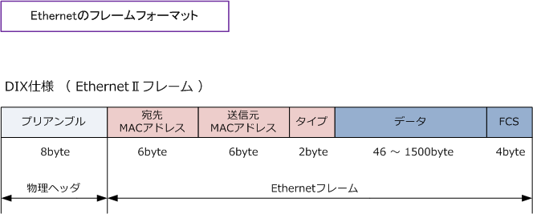

# Phase 2: Ethernetフレームパーサー（TDDで）

## このフェーズで学ぶこと

このフェーズでは、Ethernetフレームの構造と役割について学びます。具体的には、バイト列からデータを読み取るパーサーの実装方法を習得し、Rustのライフタイム（`'a`）の基本的な使い方を理解します。また、TDDで段階的に機能を追加していく方法を実践します。

---

## Ethernetフレームとは？

Ethernetフレームは、ネットワークインターフェース層で使用されるデータの単位です。同じネットワーク内のデバイス間でデータを送受信するための「封筒」のような役割を果たします。

### Ethernetフレームの構造

```text
+----------------+----------------+-----------+----------+---------+
| 宛先MACアドレス | 送信元MACアドレス | EtherType | ペイロード | FCS     |
| (6バイト)       | (6バイト)       | (2バイト)  | (可変)    | (4バイト) |
+----------------+----------------+-----------+----------+---------+
     ↑                ↑               ↑           ↑         ↑
  誰に送る？        誰から？      何のプロトコル？   実際のデータ  エラー検出
```



参考:<https://www.infraexpert.com/study/ethernet4.html>

### フィールドの説明

1. 宛先MACアドレス（Destination MAC Address）: 6バイト
   - データを受け取るデバイスのMACアドレス
   - ブロードキャスト（`ff:ff:ff:ff:ff:ff`）の場合、すべてのデバイスが受信

2. 送信元MACアドレス（Source MAC Address）: 6バイト
   - データを送信したデバイスのMACアドレス

3. EtherType: 2バイト
   - ペイロードのプロトコルを識別する
   - 代表的な値
     - `0x0800`: IPv4
     - `0x0806`: ARP（Address Resolution Protocol）
     - `0x86DD`: IPv6

4. ペイロード（Payload）: 可変長（46〜1500バイト）
   - 上位層のデータ（例：IPパケット）

5. FCS（Frame Check Sequence）: 4バイト
   - エラー検出のためのチェックサム
   - 実装では省略する場合が多い

### 最小フレームサイズ

Ethernetフレームは最小で14バイト（宛先MAC 6バイト + 送信元MAC 6バイト + EtherType 2バイト）必要です。これより短いデータはEthernetフレームとして不正です。

---

## EtherTypeとは？

EtherTypeは、Ethernetフレームのペイロードに格納されているデータのプロトコルを識別するための2バイトのフィールドです。

### 主要なEtherType値

| 値（16進数） | プロトコル | 説明 |
|-------------|----------|------|
| `0x0800` | IPv4 | インターネットプロトコルバージョン4 |
| `0x0806` | ARP | Address Resolution Protocol（IPアドレス→MACアドレス変換） |
| `0x86DD` | IPv6 | インターネットプロトコルバージョン6 |
| `0x8100` | VLAN | 仮想LAN |

---

## TODOリスト（Phase 2）

```text
Ethernetフレームパーサー
□ 14バイト未満のデータは拒否する
□ 14バイト以上のデータは受け入れる
□ 宛先MACアドレスを取得できる
□ 送信元MACアドレスを取得できる
□ EtherTypeを取得できる
□ ペイロードを取得できる
```

---

## Iteration 4: 14バイト未満のデータは拒否する

### Step 1: テストを書く（Red）

`src/ethernet.rs`に`EthernetFrame`構造体のテストを追加します。

```rust
use std::fmt;

// ... 既存のMacAddressコード ...

pub struct EthernetFrame<'a> {
    data: &'a [u8],
}

impl<'a> EthernetFrame<'a> {
    pub fn new(data: &'a [u8]) -> Option<Self> {
        // まだ実装しない
        todo!()
    }
}

#[cfg(test)]
mod tests {
    use super::*;

    // ... 既存のMACアドレステスト ...

    #[test]
    fn ethernetフレームは14バイト未満を拒否する() {
        let short_data = [0u8; 13];
        assert!(EthernetFrame::new(&short_data).is_none());
    }
}
```

このコードには2つの重要なポイントがあります。まず、ライフタイム`'a`は、`EthernetFrame`が元のバイト列への参照を保持していることを示します。これは「この参照がどれだけの期間有効か」を表すライフタイムパラメータです。次に、パースに失敗する可能性があるため、戻り値を`Option<Self>`で包んでいます。

### Step 2: テスト実行（Red確認）

```bash
cargo test ethernetフレームは14バイト未満を拒否する
```

期待される結果: `todo!()`でパニック

```text
thread 'ethernet::tests::ethernetフレームは14バイト未満を拒否する' panicked at 'not yet implemented', src/ethernet.rs:XX:YY
note: run with `RUST_BACKTRACE=1` environment variable to display a backtrace
```

✅ Red！ テストが失敗しました。

### Step 3: テストを通す最小限のコード（Green）

```rust
impl<'a> EthernetFrame<'a> {
    pub fn new(data: &'a [u8]) -> Option<Self> {
        if data.len() < 14 {
            return None;
        }
        Some(EthernetFrame { data })
    }
}
```

この実装では、Ethernetフレームの最小サイズである14バイトをチェックしています。データが不正な場合は`None`を返すことで、安全にエラーを扱えるようにしています。

#### なぜこのコードを書くのか？

#### 1. ライフタイムパラメータ`'a`とは

`EthernetFrame<'a>`の`'a`は「ライフタイム」と呼ばれるRust特有の概念です。これは、「この参照がどれだけの期間有効か」をコンパイラに伝えるための印です。

```rust
pub struct EthernetFrame<'a> {
    data: &'a [u8],  // 'a の期間だけ有効な参照
}
```

ライフタイムがないと、ダンダリングポインタなどの問題が発生する恐れがあります。

```rust
// コンパイルエラーの例
fn create_frame() -> EthernetFrame {
    let data = vec![0u8; 14];
    EthernetFrame::new(&data).unwrap()
    // ← dataはここで破棄される
    // でもEthernetFrameはdataへの参照を持っている！
    // → ダングリングポインタ（危険！）
}
```

ライフタイムパラメータにより、Rustコンパイラがこのような危険なコードをコンパイル時に検出します。

#### 2. ゼロコピー設計

`EthernetFrame`は、元のバイト列をコピーせず、参照だけを保持します。これを「ゼロコピー」設計と呼びます。

```text
メモリ上のバイト列:
[0xAA, 0xBB, 0xCC, 0xDD, 0xEE, 0xFF, ...]
 ↑
 | 参照だけを持つ（コピーしない）
 |
EthernetFrame { data: &[u8] }
```

以下のような利点があります。

- 高速: データをコピーしないので、パース処理が速い
- 省メモリ: 元のデータを再利用するので、メモリ使用量が少ない

これは、大量のパケットを高速に処理する必要があるネットワークプログラミングでは重要な最適化です。

#### 3. Option型による安全なエラー処理

`new()`メソッドは`Option<Self>`を返します。

```rust
pub fn new(data: &'a [u8]) -> Option<Self>
```

これにより、パースに失敗した場合でもプログラムがクラッシュしません。

```rust
// 安全な使用例
let data = [0u8; 10];  // 14バイト未満（不正）

match EthernetFrame::new(&data) {
    Some(frame) => {
        // パース成功、フレームを使用
        println!("Source: {}", frame.source());
    }
    None => {
        // パース失敗、エラー処理
        eprintln!("Invalid Ethernet frame");
    }
}

// または簡潔に
if let Some(frame) = EthernetFrame::new(&data) {
    // パース成功時の処理
}
```

Option型の代替案との比較。

| 方法 | 失敗時の動作 | 安全性 |
|------|------------|--------|
| `Option<T>` | `None`を返す | 安全 |
| `panic!()` | プログラムクラッシュ | 危険 |
| `Result<T, E>` | エラー詳細を返す | より詳細 |

このフェーズでは、シンプルな`Option`を使用しています。

#### 4. なぜ14バイトが最小サイズなのか

Ethernetフレームのヘッダーは以下の構成です。

```text
+------------------+------------------+-------------+
| 宛先MACアドレス   | 送信元MACアドレス | EtherType   |
| 6バイト          | 6バイト          | 2バイト     |
+------------------+------------------+-------------+
        ↓                 ↓                ↓
     必須フィールド（合計14バイト）

14バイト未満 = 不正なフレーム
```

このチェックにより、以下を保証します。

- すべての必須フィールドが存在する
- 後続の処理で配列の範囲外アクセスが起きない
- 不正なデータを早期に検出できる

### Step 4: テスト実行（Green確認）

```bash
cargo test ethernetフレームは14バイト未満を拒否する
```

✅ Green！ テストが通りました。

TODOリストを更新:

```text
Ethernetフレームパーサー
☑ 14バイト未満のデータは拒否する
□ 14バイト以上のデータは受け入れる
□ 宛先MACアドレスを取得できる
...
```

---

## Iteration 5: 14バイト以上のデータは受け入れる

### Step 1: テストを書く（Red）

```rust
#[test]
fn ethernetフレームは14バイト以上を受け入れる() {
    let valid_data = [0u8; 14];
    assert!(EthernetFrame::new(&valid_data).is_some());
}
```

### Step 2: テスト実行（Red確認）

```bash
cargo test ethernetフレームは14バイト以上を受け入れる
```

実はこれは通ってしまいます！

```text
test ethernet::tests::ethernetフレームは14バイト以上を受け入れる ... ok
```

これは、前のテストを通すために書いたコードが、このテストも通してしまったケースです。これで問題ありません。テストが既にGreenなので、次へ進みます。

ここでのTDDのポイントは、テストを書くことで実装が正しいことを確認できることです。また、既にGreenになっているテストであっても、仕様を文書化する重要な役割を果たしています。

TODOリストを更新:

```text
Ethernetフレームパーサー
☑ 14バイト未満のデータは拒否する
☑ 14バイト以上のデータは受け入れる
□ 宛先MACアドレスを取得できる
...
```

---

## Iteration 6: 宛先MACアドレスを取得できる

### Step 1: テストを書く（Red）

```rust
#[test]
fn 宛先macアドレスを取得できる() {
    let mut data = [0u8; 14];
    data[0..6].copy_from_slice(&[0xaa, 0xbb, 0xcc, 0xdd, 0xee, 0xff]);

    let frame = EthernetFrame::new(&data).unwrap();
    let expected = MacAddress::new([0xaa, 0xbb, 0xcc, 0xdd, 0xee, 0xff]);
    assert_eq!(frame.destination(), expected);
}
```

このテストコードでは2つの重要な関数を使用しています。`copy_from_slice`はスライスの一部にデータをコピーする関数です。また、`unwrap()`は`Option`から値を取り出す関数で、テストでは失敗を許容しないため使用しています。

### Step 2: テスト実行（Red確認）

```bash
cargo test 宛先macアドレスを取得できる
```

期待される結果: コンパイルエラー

```text
error[E0599]: no method named `destination` found for struct `EthernetFrame` in the current scope
  --> src/ethernet.rs:XX:YY
   |
XX |     assert_eq!(frame.destination(), expected);
   |                      ^^^^^^^^^^^ method not found in `EthernetFrame<'_>`
```

✅ Red！ 期待通りエラーが出ました。

### Step 3: テストを通す最小限のコード（Green）

```rust
impl<'a> EthernetFrame<'a> {
    pub fn new(data: &'a [u8]) -> Option<Self> {
        if data.len() < 14 {
            return None;
        }
        Some(EthernetFrame { data })
    }

    pub fn destination(&self) -> MacAddress {
        let mut bytes = [0u8; 6];
        bytes.copy_from_slice(&self.data[0..6]);
        MacAddress(bytes)
    }
}
```

この実装では、Ethernetフレームの仕様に従って最初の6バイトが宛先MACアドレスであることを利用しています。`&self.data[0..6]`というスライスの範囲指定により、必要な部分だけを取り出しています。

#### なぜこのコードを書くのか？

#### 1. スライスによる部分的なデータアクセス

Rustの「スライス」は、配列やVecの一部分への参照です。これにより、データをコピーせずに必要な部分だけにアクセスできます。

```rust
let data = [0xaa, 0xbb, 0xcc, 0xdd, 0xee, 0xff, 0x11, 0x22];

// スライス記法: &data[開始..終了]
let slice = &data[0..6];
// slice = [0xaa, 0xbb, 0xcc, 0xdd, 0xee, 0xff]
//          ↑                                 ↑
//        含む                              含まない
```

- ポイント
  - 範囲は半開区間: `0..6`は「0以上6未満」（0, 1, 2, 3, 4, 5）
  - ゼロコピー: データをコピーせず、元の配列への参照
  - 境界チェック: 範囲外アクセスはパニックを起こす（安全）

#### 2. copy_from_sliceの役割

テストコードで使われている`copy_from_slice`は、スライス間でデータをコピーする標準的な方法です。

```rust
let mut data = [0u8; 14];
data[0..6].copy_from_slice(&[0xaa, 0xbb, 0xcc, 0xdd, 0xee, 0xff]);
//   ↑                      ↑
//  コピー先               コピー元
```

仕組み。

```text
コピー前:
data = [0x00, 0x00, 0x00, 0x00, 0x00, 0x00, ...]
        ^^^^^^^^^^^^^^^^^^^^^^^^^^^^^^^^^^^^
        この範囲（0..6）に

コピー元:
[0xaa, 0xbb, 0xcc, 0xdd, 0xee, 0xff]
 ^^^^^^^^^^^^^^^^^^^^^^^^^^^^^^^^^^^^
 これをコピー

コピー後:
data = [0xaa, 0xbb, 0xcc, 0xdd, 0xee, 0xff, ...]
```

エラー処理。

```rust
// サイズが一致しない場合はパニック
let mut data = [0u8; 4];
data.copy_from_slice(&[1, 2, 3, 4, 5]);  // パニック！
```

#### 3. Ethernetフレーム内のMACアドレスの位置

Ethernetフレームでは、MACアドレスの位置が厳格に定義されています。

```text
Ethernetフレーム（最小14バイト）:

バイト位置:  0  1  2  3  4  5  6  7  8  9 10 11 12 13
           +--+--+--+--+--+--+--+--+--+--+--+--+--+--+
           |  宛先MACアドレス |  送信元MACアドレス | ET |
           +--+--+--+--+--+--+--+--+--+--+--+--+--+--+
            ↑              ↑  ↑                ↑  ↑
           0..6          [5] 6..12           [11] 12..14

宛先MAC:   data[0..6]
送信元MAC: data[6..12]
EtherType: data[12..14]
```

この位置は、IEEE 802.3規格で定義されており、世界中のすべてのEthernet実装で共通です。

#### 4. 配列とMacAddressへの変換

実装では、スライスから固定長配列を作り、それを`MacAddress`に変換しています。

```rust
pub fn destination(&self) -> MacAddress {
    let mut bytes = [0u8; 6];  // 1. 6バイトの配列を作成
    bytes.copy_from_slice(&self.data[0..6]);  // 2. データをコピー
    MacAddress(bytes)  // 3. MacAddressを構築
}
```

なぜ直接スライスを使わないのか。

```rust
// これはできない
MacAddress(&self.data[0..6])  // エラー！
// MacAddressは [u8; 6] を要求するが、&[u8] が渡されている
```

Rustでは、スライス（`&[u8]`）と配列（`[u8; 6]`）は異なる型です。

- スライス `&[u8]`: 長さが実行時に決まる
- 配列 `[u8; 6]`: 長さが6で固定（コンパイル時に決定）

`MacAddress`は固定長（6バイト）を保証したいので、配列型を使用します。

### Step 4: テスト実行（Green確認）

```bash
cargo test
```

✅ Green！ 全テスト成功。

TODOリストを更新:

```text
Ethernetフレームパーサー
☑ 14バイト未満のデータは拒否する
☑ 14バイト以上のデータは受け入れる
☑ 宛先MACアドレスを取得できる
□ 送信元MACアドレスを取得できる
...
```

---

## Iteration 7: 送信元MACアドレスを取得できる

### あなたの番

ここからは、同じパターンで自分で実装してみましょう。

### Step 1: テストを書く（Red）

```rust
#[test]
fn 送信元macアドレスを取得できる() {
    let mut data = [0u8; 14];
    data[6..12].copy_from_slice(&[0x11, 0x22, 0x33, 0x44, 0x55, 0x66]);

    let frame = EthernetFrame::new(&data).unwrap();
    let expected = MacAddress::new([0x11, 0x22, 0x33, 0x44, 0x55, 0x66]);
    assert_eq!(frame.source(), expected);
}
```

実装のヒントとして、送信元MACアドレスは6〜11バイト目（0から数えて6〜11）に位置しています。`destination()`メソッドと同じパターンで実装することができます。

### Step 2-4: Red → Green → Refactor

実装例:

```rust
pub fn source(&self) -> MacAddress {
    let mut bytes = [0u8; 6];
    bytes.copy_from_slice(&self.data[6..12]);
    MacAddress(bytes)
}
```

---

## Iteration 8: EtherTypeを取得できる

### EtherType型の定義

まず、EtherTypeを表す`enum`を定義します。

### Step 1: テストを書く（Red）

```rust
#[test]
fn ethertypeがipv4の場合() {
    let mut data = [0u8; 14];
    data[12] = 0x08;
    data[13] = 0x00;

    let frame = EthernetFrame::new(&data).unwrap();
    // まだEtherType型がないのでコンパイルエラーになる
    assert_eq!(frame.ether_type(), EtherType::Ipv4);
}
```

### Step 2: 最小限の実装（Green）

```rust
#[derive(Debug, Clone, Copy, PartialEq, Eq)]
pub enum EtherType {
    Ipv4,
}

impl<'a> EthernetFrame<'a> {
    // ... 既存のメソッド ...

    pub fn ether_type(&self) -> EtherType {
        EtherType::Ipv4  // とりあえずこれで通る
    }
}
```

TDDでは、最初は「仮実装」でテストを通すことが重要です。完全な実装は必要なく、次のテストを追加した時点で一般化が必要になります。

### Step 3: 次のテストを追加して一般化

```rust
#[test]
fn ethertypeがarpの場合() {
    let mut data = [0u8; 14];
    data[12] = 0x08;
    data[13] = 0x06;

    let frame = EthernetFrame::new(&data).unwrap();
    assert_eq!(frame.ether_type(), EtherType::Arp);
}
```

これで初めて、実際にバイト列を読む実装が必要になります。

```rust
#[derive(Debug, Clone, Copy, PartialEq, Eq)]
pub enum EtherType {
    Ipv4,
    Arp,
    Unknown(u16),
}

impl<'a> EthernetFrame<'a> {
    pub fn ether_type(&self) -> EtherType {
        let value = u16::from_be_bytes([self.data[12], self.data[13]]);
        match value {
            0x0800 => EtherType::Ipv4,
            0x0806 => EtherType::Arp,
            _ => EtherType::Unknown(value),
        }
    }
}
```

この実装には3つの重要なポイントがあります。まず、`u16::from_be_bytes`を使ってビッグエンディアンの2バイトを`u16`に変換しています。ビッグエンディアンとは上位バイトが先に来る形式で、ネットワークバイトオーダーとも呼ばれます。また、`Unknown(u16)`というバリアントを用意することで、未知のEtherTypeも扱えるようにしています。

#### なぜこのコードを書くのか？

#### 1. ビッグエンディアンとは

ネットワークプロトコルでは、2バイト以上の数値は必ず「ビッグエンディアン」（Big-Endian）形式で送信されます。これは「ネットワークバイトオーダー」とも呼ばれます。

```text
値: 0x0800 (IPv4を示すEtherType)

ビッグエンディアン（ネットワーク）:
メモリ/パケット上の並び:
data[12] = 0x08  ← 上位バイト（Big End = 大きい方が先）
data[13] = 0x00  ← 下位バイト

リトルエンディアン（多くのCPU）:
メモリ上の並び:
data[12] = 0x00  ← 下位バイト（Little End = 小さい方が先）
data[13] = 0x08  ← 上位バイト
```

なぜビッグエンディアンを使うのか。

- 標準化: すべてのネットワーク機器が同じバイトオーダーを使う
- 互換性: CPUアーキテクチャの違いを吸収
- 歴史的理由: 初期のネットワークプロトコルがビッグエンディアンを採用

#### 2. u16::from_be_bytesの詳細

Rustの`from_be_bytes`メソッドは、バイト配列からビッグエンディアン形式の数値を作成します。

```rust
let value = u16::from_be_bytes([self.data[12], self.data[13]]);
```

具体例。

```text
パケットのバイト列:
data[12] = 0x08
data[13] = 0x00

↓ from_be_bytes([0x08, 0x00])

結果: 0x0800 (u16)
```

CPUアーキテクチャに関わらず動作。

```rust
// x86/x64（リトルエンディアン）でも
let value = u16::from_be_bytes([0x08, 0x00]);
assert_eq!(value, 0x0800);  // ← 正しく0x0800になる

// ARM（リトルエンディアン）でも
let value = u16::from_be_bytes([0x08, 0x00]);
assert_eq!(value, 0x0800);  // ← 正しく0x0800になる
```

#### 3. match式によるEtherTypeの判定

`match`式を使って、数値を対応するプロトコルに変換します。

```rust
match value {
    0x0800 => EtherType::Ipv4,
    0x0806 => EtherType::Arp,
    _ => EtherType::Unknown(value),
}
```

これはif-else文より読みやすく、網羅性チェックもあります。

```rust
// match式（推奨）
match ether_type {
    EtherType::Ipv4 => { /* IPv4処理 */ }
    EtherType::Arp => { /* ARP処理 */ }
    EtherType::Unknown(v) => { /* 未知のプロトコル */ }
    // すべてのケースを網羅しないとコンパイルエラー
}

// if-else文（冗長）
if ether_type == EtherType::Ipv4 {
    // IPv4処理
} else if ether_type == EtherType::Arp {
    // ARP処理
} else {
    // その他
}
```

#### 4. Unknown(u16)の重要性

すべてのEtherType値を実装する必要はありません。`Unknown(u16)`により、未実装のプロトコルも扱えます。

```rust
pub enum EtherType {
    Ipv4,
    Arp,
    Unknown(u16),  // 未知のプロトコルを保持
}
```

実際の使用例。

```rust
let ether_type = frame.ether_type();

match ether_type {
    EtherType::Ipv4 => {
        // IPv4パケットとして処理
        let ip_packet = Ipv4Packet::new(frame.payload()).unwrap();
        // ...
    }
    EtherType::Arp => {
        // ARPパケットとして処理（未実装でもOK）
        println!("ARP packet detected");
    }
    EtherType::Unknown(value) => {
        // 未知のプロトコルをログ出力
        eprintln!("Unknown EtherType: 0x{:04x}", value);
    }
}
```

これにより、未知のプロトコルでパースが失敗することを防ぎます。

---

## Iteration 9: ペイロードを取得できる

### ペイロードとは？

ペイロード（Payload）は、Ethernetフレームの実際のデータ部分です。上位層のプロトコル（IPv4パケットなど）が含まれます。

### Step 1: テストを書く（Red）

```rust
#[test]
fn ペイロードを取得できる() {
    let mut data = vec![0u8; 20];
    data[14..20].copy_from_slice(b"Hello!");

    let frame = EthernetFrame::new(&data).unwrap();
    assert_eq!(frame.payload(), b"Hello!");
}
```

このテストコードでは、`vec!`マクロを使って動的配列（可変長データ）を作成しています。また、`b"Hello!"`はバイト列リテラルで、文字列を直接バイト列として扱うことができます。

### Step 2-4: Red → Green

実装例:

```rust
pub fn payload(&self) -> &[u8] {
    &self.data[14..]
}
```

この実装では、`&self.data[14..]`という記法で14バイト目以降のすべてのデータを取得しています。返り値を参照（`&[u8]`）にすることで、データをコピーせずに効率的にアクセスできます。

#### なぜこのコードを書くのか？

#### 1. 開始位置だけを指定するスライス

スライス記法では、終了位置を省略できます。

```rust
let data = [0, 1, 2, 3, 4, 5, 6, 7, 8, 9];

// 開始位置だけ指定（終わりまで）
let slice = &data[5..];
// slice = [5, 6, 7, 8, 9]

// 終了位置だけ指定（最初から）
let slice = &data[..5];
// slice = [0, 1, 2, 3, 4]

// 両方省略（全体）
let slice = &data[..];
// slice = [0, 1, 2, 3, 4, 5, 6, 7, 8, 9]
```

Ethernetフレームの場合。

```text
パケット構造:

バイト位置:  0  ...  13  14  15  16  ...
           +--------+--+---+---+---+---+
           |ヘッダー|  |   ペイロード   |
           |(14バイト)|   (可変長)     |
           +--------+--+---+---+---+---+
                       ↑
                    &data[14..]
                    14バイト目から終わりまで
```

#### 2. 参照を返す理由

`payload()`メソッドは、データをコピーせず、参照（`&[u8]`）を返します。

```rust
pub fn payload(&self) -> &[u8] {
    &self.data[14..]  // コピーせず、参照を返す
}
```

これには2つの利点があります。

パフォーマンス: データをコピーしないので高速

```rust
// 参照を返す（高速）
let payload = frame.payload();
// → データはコピーされない

// Vec<u8>を返す（低速）
let payload = frame.payload().to_vec();
// → データがコピーされる（必要な場合のみ）
```

メモリ効率: 同じデータを再利用

```text
元のパケットデータ:
[ヘッダー14バイト | ペイロード1000バイト]

EthernetFrame:
  data: &元のパケットデータ  ← 参照

payload():
  &元のパケットデータ[14..]  ← さらにその一部への参照

→ メモリは1つだけ、参照を複数持つ
```

#### 3. ライフタイムと参照の関係

`payload()`の戻り値のライフタイムは、`self`と同じです。

```rust
impl<'a> EthernetFrame<'a> {
    pub fn payload(&self) -> &[u8] {
        //           ↑ ライフタイムは'aと推論される
        &self.data[14..]
    }
}

// 完全に書くと:
pub fn payload(&self) -> &'a [u8] {
    &self.data[14..]
}
```

これにより、以下のような危険なコードを防ぎます。

```rust
// コンパイルエラーの例
fn get_payload() -> &[u8] {
    let data = vec![0u8; 100];
    let frame = EthernetFrame::new(&data).unwrap();
    frame.payload()
    // ← dataがここで破棄される
    // でもpayloadはdataへの参照を含む！
    // → コンパイルエラー
}
```

#### 4. 層構造とペイロードの連鎖

Ethernetフレームのペイロードは、さらにIPv4パケットとしてパースできます。

```rust
// Ethernetフレームをパース
let eth_frame = EthernetFrame::new(&packet_data).unwrap();

// Ethernetのペイロード = IPv4パケット
let eth_payload = eth_frame.payload();

// IPv4パケットをパース
let ipv4_packet = Ipv4Packet::new(eth_payload).unwrap();

// IPv4のペイロード = TCPセグメント
let ipv4_payload = ipv4_packet.payload();

// TCPセグメントをパース
let tcp_segment = TcpPacket::new(ipv4_payload).unwrap();
```

このように、各層のペイロードが次の層のデータになります。

```text
プロトコルスタック:

+----------------------------+
| Ethernetヘッダー (14バイト) |
+----------------------------+
| IPv4ヘッダー (20バイト)     | ← Ethernetのペイロード
+----------------------------+
| TCPヘッダー (20バイト)      | ← IPv4のペイロード
+----------------------------+
| アプリケーションデータ      | ← TCPのペイロード
+----------------------------+
```

参照を使うことで、すべて元のパケットデータへの参照として扱えます（ゼロコピー）。

---

## Phase 2の完全なコード

```rust
use std::fmt;

#[derive(Debug, Clone, Copy, PartialEq, Eq)]
pub struct MacAddress(pub [u8; 6]);

impl MacAddress {
    pub fn new(bytes: [u8; 6]) -> Self {
        MacAddress(bytes)
    }

    pub fn broadcast() -> Self {
        MacAddress([0xff; 6])
    }
}

impl fmt::Display for MacAddress {
    fn fmt(&self, f: &mut fmt::Formatter) -> fmt::Result {
        write!(
            f,
            "{:02x}:{:02x}:{:02x}:{:02x}:{:02x}:{:02x}",
            self.0[0], self.0[1], self.0[2], self.0[3], self.0[4], self.0[5]
        )
    }
}

#[derive(Debug, Clone, Copy, PartialEq, Eq)]
pub enum EtherType {
    Ipv4,
    Arp,
    Unknown(u16),
}

pub struct EthernetFrame<'a> {
    data: &'a [u8],
}

impl<'a> EthernetFrame<'a> {
    pub fn new(data: &'a [u8]) -> Option<Self> {
        if data.len() < 14 {
            return None;
        }
        Some(EthernetFrame { data })
    }

    pub fn destination(&self) -> MacAddress {
        let mut bytes = [0u8; 6];
        bytes.copy_from_slice(&self.data[0..6]);
        MacAddress(bytes)
    }

    pub fn source(&self) -> MacAddress {
        let mut bytes = [0u8; 6];
        bytes.copy_from_slice(&self.data[6..12]);
        MacAddress(bytes)
    }

    pub fn ether_type(&self) -> EtherType {
        let value = u16::from_be_bytes([self.data[12], self.data[13]]);
        match value {
            0x0800 => EtherType::Ipv4,
            0x0806 => EtherType::Arp,
            _ => EtherType::Unknown(value),
        }
    }

    pub fn payload(&self) -> &[u8] {
        &self.data[14..]
    }
}

#[cfg(test)]
mod tests {
    use super::*;

    // MACアドレステスト
    #[test]
    fn macアドレスを作成できる() {
        let mac = MacAddress::new([0x00, 0x11, 0x22, 0x33, 0x44, 0x55]);
        assert_eq!(mac.0, [0x00, 0x11, 0x22, 0x33, 0x44, 0x55]);
    }

    #[test]
    fn macアドレスを文字列表示できる() {
        let mac = MacAddress::new([0xaa, 0xbb, 0xcc, 0xdd, 0xee, 0xff]);
        assert_eq!(format!("{}", mac), "aa:bb:cc:dd:ee:ff");
    }

    #[test]
    fn ブロードキャストアドレスを作成できる() {
        let broadcast = MacAddress::broadcast();
        assert_eq!(broadcast.0, [0xff; 6]);
    }

    // Ethernetフレームテスト
    #[test]
    fn ethernetフレームは14バイト未満を拒否する() {
        let short_data = [0u8; 13];
        assert!(EthernetFrame::new(&short_data).is_none());
    }

    #[test]
    fn ethernetフレームは14バイト以上を受け入れる() {
        let valid_data = [0u8; 14];
        assert!(EthernetFrame::new(&valid_data).is_some());
    }

    #[test]
    fn 宛先macアドレスを取得できる() {
        let mut data = [0u8; 14];
        data[0..6].copy_from_slice(&[0xaa, 0xbb, 0xcc, 0xdd, 0xee, 0xff]);

        let frame = EthernetFrame::new(&data).unwrap();
        let expected = MacAddress::new([0xaa, 0xbb, 0xcc, 0xdd, 0xee, 0xff]);
        assert_eq!(frame.destination(), expected);
    }

    #[test]
    fn 送信元macアドレスを取得できる() {
        let mut data = [0u8; 14];
        data[6..12].copy_from_slice(&[0x11, 0x22, 0x33, 0x44, 0x55, 0x66]);

        let frame = EthernetFrame::new(&data).unwrap();
        let expected = MacAddress::new([0x11, 0x22, 0x33, 0x44, 0x55, 0x66]);
        assert_eq!(frame.source(), expected);
    }

    #[test]
    fn ethertypeがipv4の場合() {
        let mut data = [0u8; 14];
        data[12] = 0x08;
        data[13] = 0x00;

        let frame = EthernetFrame::new(&data).unwrap();
        assert_eq!(frame.ether_type(), EtherType::Ipv4);
    }

    #[test]
    fn ethertypeがarpの場合() {
        let mut data = [0u8; 14];
        data[12] = 0x08;
        data[13] = 0x06;

        let frame = EthernetFrame::new(&data).unwrap();
        assert_eq!(frame.ether_type(), EtherType::Arp);
    }

    #[test]
    fn ペイロードを取得できる() {
        let mut data = vec![0u8; 20];
        data[14..20].copy_from_slice(b"Hello!");

        let frame = EthernetFrame::new(&data).unwrap();
        assert_eq!(frame.payload(), b"Hello!");
    }
}
```

---

## TDDの重要ポイント（復習）

ここまでで、TDDの本質がさらに見えてきたはずです。

### 1. 小さく進む

一度に全部を実装しない。一つのテストケースだけに集中する。

### 2. Red → Green → Refactor のリズム

- Red: テストを書いて失敗を確認（コンパイルエラーも"Red"）
- Green: そのテストだけを通す最小限のコード
- Refactor: テストを保ったままコードをきれいにする

### 3. 「最小限」の実装

例えば、こんなコードでもいい（実際のTDDではよくやる）。

```rust
// 最初のテストを通すための「仮実装」
pub fn ether_type(&self) -> EtherType {
    EtherType::Ipv4  // ベタ書き
}

// 次のテストで一般化が必要になったら、その時リファクタリング
```

### 4. TODOリストは生きている

テストを書いていて気づいたことは、すぐにTODOリストに追加する。

---

## Phase 2のまとめ

このフェーズでは、以下を学びました。

### Ethernetフレームの理解

Ethernetフレームの基本構造を理解しました。最小サイズは14バイトで、これは宛先MAC（6バイト）、送信元MAC（6バイト）、EtherType（2バイト）から構成されます。EtherTypeフィールドでペイロードのプロトコルを識別し、ペイロードには上位層のデータが格納されます。

### Rustの機能

Rustの重要な機能を学習しました。ライフタイム（`'a`）は参照の有効期間を示す仕組みです。また、スライス、`copy_from_slice`、`from_be_bytes`といったバイト列操作の方法を習得しました。さらに、`match`を使ったパターンマッチングによる値の分岐処理も学びました。

### TDDの実践

TDDの重要な技法を実践しました。仮実装から始めて段階的に一般化する手法を学び、テストが既にGreenの場合でも仕様を文書化するという価値があることを理解しました。

---

## 次のステップ

Phase 2が完了しました！次は[Phase 3: IPv4パケットパーサー](./phase3-ipv4-packet.md)に進みましょう。

IPv4はインターネット層のプロトコルで、Ethernetフレームのペイロードに格納されます。IPアドレスによるルーティング、パケットの分割・再構成など、より高度な機能を持っています。

---

## ナビゲーション

- 前へ：[Phase 1: MACアドレス実装](./phase1-mac-address.md)
- 次へ：[Phase 3: IPv4パケットパーサー](./phase3-ipv4-packet.md)
- ホーム：[README](../README.md)
